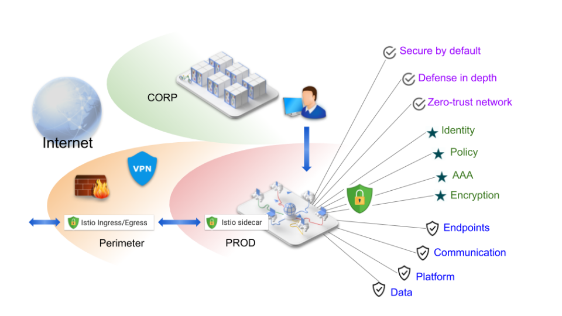

# Istio


微服务框架问题：

- 微服务框架版本升级成本高

- 旧服务接入微服务框架困难

- 微服务框架一般仅支持单一的语言


Istio核心功能：

- **流量管理（主要能力）**：可配置丰富的路由策略，轻松实现负载均衡、故障转移、A/B测试、金丝雀发布等功能
- **安全**：网络通讯层面提供了安全的通信隧道，使用户只需要专注于应用程序级别的安全；还通过RBAC模型管理服务的认证和授权，也支持在集群中实现安全的服务间通信
- **可观测**：集群内（包括集群的入口和出口）所有流量的自动化追踪、监控和日志记录
- **平台独立**：可运行在各种环境，包括：跨云、内部环境、Kubernetes、Mesos


## 名词解释


Service Mesh：服务网格，通过在应用程序旁边部署一个Sidecar进程代理Pod的网络通讯来和其他微服务网格进行交互，最出名的是开源的Istio

Control Plane / Data Plane：控制面 / 数据面，控制面仅仅负责配置的下发以及达成配置的期望状态；数据面通过配置来真正的控制应用；在Istio中Istiod为控制面，Sidecar(Envoy)为数据面

Workload：工作负载，可以理解为k8s里的Deployment

Workload Instance：工作负载实例，可以理解为k8s里的Pod

Sidecar：服务网格的边车服务，Istio中使用Envoy作为Sidecar

Envoy：在 Istio 里使用的 C++ 开发的高性能代理（Sidecar），用于为所有服务网格里的服务调度进出的流量，另一个开源项目，Istio并不是强绑定它，使用了Envoy的扩展版本

Istiod：单体 Control Plane 二进制的组合体，封装了 Pilot、Citadel、Galley 和 Sidecar 注入器的功能

Pilot：Istio组件之一，配置信息推送以达到控制Envoy代理，负责服务发现、负载均衡和路由分发

Citadel：Istio组件之一，TLS证书的分发和轮转

Galley：Istio组件之一，配置的格式校验，解析配置为xDS协议的格式，然后提供给Pilot

~~Mixer：Istio组件之一，增强服务网格里的访问控制和使用策略，还负责收集来自envoy和其他服务的遥测数据~~，Istio旧版本组件，被WebAssembly取代

istio-init： 部署在Pod内的一个容器，对Pod进行一些初始化操作，设置 iptables 规则将 pod 的网络流量劫持到 sidecar上，然后退出，是k8s的init容器

istio-proxy：部署在Pod内的一个容器，内部运行pilot-agent和envoy两个进程

pilot-agent：也叫 istio-agent（官网表述），和envoy一样作为一个独立的进程部署在istio-proxy内，管理envoy的生命周期（创建、销毁、配置变更reload）

Upstream：A调用B服务，**B服务作为Upstream**（上游服务），中文确实下游的感觉

Downstream：A调用B服务，**A服务作为Downstream**（下游服务），中文确实上游的感觉

南北向流量/纵向流量：客户端到服务器的流量

东西向流量/横向流量：服务器之间的流量

Source：Source 是 Envoy 代理的下游客户端。在服务网格里，source 通常是一个工作负载，但是入口流量的 source 有可能包含其他客户端，例如浏览器，或者一个移动应用

CIDR表示法：Classless Inter Domain Routing，无类间域路由，IP地址表示法，格式：1.1.1.1/24，https://blog.csdn.net/cumo7370/article/details/107393927

四层负载均衡器，性能较高；七层负载均衡器，有较多的负载均衡策略

P2C：Pick of 2 Choices，二选一，即从可用节点列表中随机选择两个节点，计算它们的负载率load，选择负载率较低的进行请求

恐慌阈值：健康检查失败后，如果可用服务低于给定阈值，则会将有问题的服务也暴露出来使用，一般设置为10%

Region：地域，表示国家的一个范围，如 us-east，美国的东部，其中会包含很多个区，k8s的label：`https://topology.kubernetes.io/region`

Zone：区域，表示一个具体的区，k8s的label：`https://topology.kubernetes.io/zone`

Sub-zone：区域中的某个机架，istio的进一步细分的概念，istio的label：`https://topology.istio.io/subzone`

AAA：Authentication/Authorization/Audit，认证、授权和审计

PEPs： Policy Enforcement Points，策略实施点，Istio用envoy实现来建立客户端和服务器之间的安全通信隧道

TLS Termination：TLS终止，表示一个https请求转换为http请求进入到内部服务

TLS Origination：TLS发起，表示一个http请求转换为https请求发送到外部服务


Endpoint：实际的一个服务入口点，如应用暴露的一个端口，这个端口能力就是一个Endpoint

FQDN：Fully Qualified Domain Name，一般使用简写名称为服务名，但推荐用全限定名，在k8s中为`[serviceName].[namespace].svc.[clusterDomain]`，默认为`serviceName.default.svc.cluster.local`

动态准入控制：k8s用于在API Server处理CRD时对资源进行拦截做额外操作的扩展功能，Istio中用来在Pod中注入Sidecar配置

CRD：Custom Resource Definition，自定义资源定义，k8s的扩展能力

xDS：SDS、EDS、LDS、RDS、CDS的统称，k8s概念，xDS类型数据存储，请求类型在type_url字段中，值如：type.googleapis.com/envoy.api.v2.Cluster；gRPC协议支持xDS格式

SDS：Secret Discovery Service，秘钥发现服务

EDS：Endpoint Discovery Service，端点发现协议

LDS：Listener Discovery Service，监听器发现服务

RDS：Route Discovery Service，路由发现解析，动态发现路由的变化来更新调用端路由配置

CDS：Cluster Discovery Service，集群发现服务

CNI：Container Network Interface：容器网络接口，一个规范标准，k8s概念


CSR：Certificate Signing Requests，证书认证请求，TLS概念

SNI：Server Name Indication：通过TLS握手包内的额外信息获取发送请求的host信息，一般用于在网关层匹配后面的代理主机，SNI 字段在 TLS 握手过程中以未加密的形式发送

ALPN：Application Layer Protocol Negotiation，应用层协议协商，协商交互C/S的通讯协议，TLS内有使用到，Istio也定义了一套协商规则，用于客户端向Sidecar通讯


Spiffe：每个人的安全生产身份框架（SPIFFE）项目定义了一个框架和一套标准，用于识别和保护基于 web-based 的服务之间的通信

eBPF：Extended Berkeley Packet Filter，一种新的网络数据包的过滤的框架

FaaS：Function as a Service，开源项目：knative/openfaas/fission/kubeless


## 安装

1、下载 Istio安装包，并解压

```shell
# 官方推荐安装方法，内部自动下载对应系统的istio二进制文件
curl -L https://istio.io/downloadIstio | ISTIO_VERSION=1.15.2 sh -
tar -zxf istio-1.15.2-linux-amd64.tar.gz
```

2、进入Istio文件夹

```shell
# 暴露 istioctl 命令
cd istio-1.15.2
echo 'export PATH='$(pwd)'/bin:$PATH' >> /etc/profile
source /etc/profile
```

3、安装 Istio，使用默认的default环境

```shell
# 使用其他环境 --set profile=demo，manifests/profiles/xxx,yaml配置档
# 修改istio默认的gateway使用NodePort的方式暴露
istioctl install --set values.gateways.istio-ingressgateway.type=NodePort -y
```

4、验证安装完成

```shell
kubectl get service -n istio-system -o wide
kubectl get pod -n istio-system -o wide
```

5、启用default命名空间的sidecar注入

```shell
kubectl label namespace default istio-injection=enabled
```

> 某些 Pod 不注入的情况，可以配置 Deployment 的 annotations 来禁用
>
> ```yaml
> apiVersion: apps/v1
> kind: Deployment
> metadata:
>     annotations:
>        sidecar.istio.io/inject: "false"
> ```

> 不指定命名空间时，用命令行手动注入
>
> ```shell
> kubectl apply -f <(istioctl kube-inject -f xxx.yaml)
> ```


**istio启动时如果pod出现Init:CrashLoopBackOff状态**

如果pod出现`Init:CrashLoopBackOff`状态，检查istio-init进程日志

```shell
kubectl logs productpage-v1-6b746f74dc-4hdpp istio-init
```

出现下列日志：

```
2021-12-27T09:06:18.692140Z     info    Running command: iptables-restore --noflush /tmp/iptables-rules-1640595978692007050.txt1847614466
2021-12-27T09:06:18.694937Z     error   Command error output: xtables parameter problem: iptables-restore: unable to initialize table 'nat'
 
Error occurred at line: 1
Try `iptables-restore -h' or 'iptables-restore --help' for more information.
2021-12-27T09:06:18.694953Z     error   Failed to execute: iptables-restore --noflush /tmp/iptables-rules-1640595978692007050.txt1847614466, exit status 2
```

原因：**iptables模块未被加载，所以我们可以尝试在所有k8s集群节点上加载iptables模块**

```shell
# 临时生效
modprobe ip_tables
modprobe iptable_filter
modprobe iptable_nat

# 永久生效
[root@k8s-master ~]# cat /etc/sysconfig/modules/iptables.modules
modprobe -- ip_tables
modprobe -- iptable_filter
modprobe -- iptable_nat
[root@k8s-master ~]# chmod 755 /etc/sysconfig/modules/iptables.modules   #设置权限
```


卸载：

```shell
# 卸载istio组件
istioctl uninstall --purge
# 删除命名空间
kubectl delete namespace istio-system
# 删除default命名空间的sidecar注入标签
kubectl label namespace default istio-injection-
```


Istioctl安装：https://istio.io/latest/zh/docs/setup/install/istioctl/

定制安装网格：

```shell
istioctl install --set meshConfig.xxx=xxx # 命令行配置
istioctl install -f my-config.yaml # 文件配置（推荐）
```

```yaml
# my-config.yaml，也是Operator形式的安装
apiVersion: install.istio.io/v1alpha1
kind: IstioOperator
spec:
  meshConfig:
    accessLogFile: /dev/stdout
```


多网格/多集群/多地域/多区域/控制面、数据面分离/跨网络安装：

https://istio.io/latest/docs/setup/install/multicluster/


> 安装后，如果对mesh配置文件有更改要应用的，可以再次执行install命令


## 核心CRD


VirtualService：配置流量路由到**哪种**服务，流量分发

DestinationRule：配置服务子集的流量路由规则，即匹配服务内哪些具体的实例，对流量进一步细粒度的切分

Gateway：网关服务，对入口和出口流量进行统一管理，k8s的ingress/egress的增强版

ServiceEntry：将外部服务注册到istio自身的注册中心，来方便外部服务使用istio的能力

PeerAuthentication：服务之间的认证策略

RequestAuthentication：基于jwt的认证策略

AuthorizationPolicy：RBAC模型的授权策略，一般配合RequestAuthentication使用

Telemetry：配置可观测能力


## 核心功能

### 流量管理

为了在网格中导流，Istio 需要知道所有的 endpoint 在哪并且属于哪个服务，就需要连接到一个服务注册中心，然后Envoy 代理可以将流量定向到相关服务。

每个服务的工作负载都有多个实例来处理流量，称为负载均衡池，默认情况下，Envoy 代理基于轮询调度模型在服务的负载均衡池内分发流量。

通过这些基本的服务发现和负载均衡能力就可以提供了一个可用的服务网格。


而虚拟服务（Virtual Service） 和目标规则（Destination Rule） 是 Istio 流量路由功能的关键，主要目的是如何在服务网格内将请求路由到服务。


#### VirtualService

一个典型的例子是将流量发送到不同版本的服务子集，像 Kubernetes 这样的容器编排平台只支持基于实例缩放的流量分发，情况非常复杂，而配置虚拟服务（Virtual Service）可以将**多个真实服务映射到单一的虚拟服务**，通过一个虚拟服务就可以方便的对不同的服务进行统一管理。


分流的入门示例：

```yaml
apiVersion: networking.istio.io/v1alpha3
kind: VirtualService
metadata:
  name: exam
spec:
  hosts:
  - exam.com # 匹配的服务主机地址，推荐FQDN
  http: # 匹配http流量
  - match: # 流量匹配条件，多个从上往下顺序匹配
    - uri:
        prefix: /reviews
    route:
    - destination:
        host: reviews # 路由到的服务主机地址，推荐FQDN
        subset: v2 # 指定目标地址的子集，如果不需要对服务子集精细化控制，则不需要指定
  - route: # 没有指定match，表示特定服务默认配置（推荐指定，确保虚拟服务能正确匹配路由）
    - destination:
        host: reviews2
        subset: v3
```


百分比权重分流的入门示例：

```yaml
apiVersion: networking.istio.io/v1alpha3
kind: VirtualService
metadata:
  name: exam
spec:
  hosts:
  - reviews
  http:
  - route:
    - destination:
        host: reviews1
      weight: 75 # 指定百分比权重
    - destination:
        host: reviews2
      weight: 25
```


#### DestinationRule

在某些情况下，还需要配置目标规则（Destination Rule）来精细化这些特性，因为这是指定服务子集的地方。在一个单独的对象中指定服务子集和其它特定目标策略，有利于**在虚拟服务之间更简洁地重用这些路由规则**。


负载均衡的入门示例：

```yaml
apiVersion: networking.istio.io/v1alpha3
kind: DestinationRule
metadata:
  name: my-destination-rule
spec:
  host: my-svc # 应用的服务名
  trafficPolicy: # 核心策略对象，此处为服务的全局默认配置
    loadBalancer: # 负载均衡策略
      simple: RANDOM
  subsets: # 服务子集
  - name: v1
    labels: # 子集(endpoint)匹配的标签，路由到这的服务子集流量必须有version=v1的标签
      version: v1
    trafficPolicy: # 特定子集配置，覆盖全局配置
      loadBalancer:
        simple: ROUND_ROBIN
  - name: v2
    labels:
      version: v2
  - name: v3
    labels:
      version: v3
```


#### Gateway

网关（Gateway）为网格来管理入站和出站流量，可以**限制要进入或离开网格的流量**。网关配置被用于运行在网格边界的独立 Envoy 代理（边缘网关），而不是服务工作负载的 sidecar 代理。网关可以配置 L4 - L6 的流量策略，L7 的策略通常需要绑定Virtual Service。


暴露https端口的入门示例：

```yaml
apiVersion: networking.istio.io/v1alpha3
kind: Gateway
metadata:
  name: ext-host-gwy
spec:
  selector:
    app: istio-ingressgateway # 默认gateway控制器,isito默认添加一个gateway的service（istio安装时添加的），选择它
  servers:
  - port: # 暴露443端口，接受https流量
      number: 443
      name: https
      protocol: HTTPS
    hosts:
    - ext-host.example.com # 仅允许特定主机服务进入
    tls: # tls模式配置
      mode: SIMPLE
      serverCertificate: /tmp/tls.crt
      privateKey: /tmp/tls.key
```

该配置仅允许流量进入网关，但没有任何路由规则，流量不知道该怎么继续。所以如果要进行流量分发，则还需要将VirtualService绑定到网关

```yaml
apiVersion: networking.istio.io/v1alpha3
kind: VirtualService
metadata:
  name: virtual-svc
spec:
  hosts:
  - ext-host.example.com
  gateways: # 指定gateways字段，表示该vs仅用于网关，如果还需要应用到sidecar，则还需要指定默认的mesh
    - ext-host-gwy # 指定网关名称
```


Ingress Gateway使用场景：

- 将服务暴露至服务网格之外
- 将 Istio 功能（例如监控和路由规则）应用于进入集群的流量


Egress Gateway使用场景：

- 要求服务网格所有的出站流量必须经过一组专用节点
- 网格 service 无法访问互联网，将公有 IP 分配给 egress gateway 节点，用它引导所有的出站流量


网关配置TLS：https://istio.io/latest/zh/docs/tasks/traffic-management/ingress/secure-ingress/

k8s Gateway：https://istio.io/latest/zh/docs/tasks/traffic-management/ingress/gateway-api/

k8s Egress Gateway：https://istio.io/latest/zh/docs/tasks/traffic-management/egress/egress-kubernetes-services/


**暴露网关：**

通过 NodePort 暴露：

istio安装时，指定配置文件中的`values.gateways.istio-ingressgateway.type=NodePort`


通过 LoadBalancer 暴露：

https://blog.csdn.net/sunjinyan_1/article/details/126042464


##### Egress使用

```shell
# 暴露一个服务
kubectl apply -f - <<EOF
apiVersion: networking.istio.io/v1alpha3
kind: ServiceEntry
metadata:
  name: cnn
spec:
  hosts:
  - edition.cnn.com
  ports:
  - number: 80
    name: http-port
    protocol: HTTP
  - number: 443
    name: https
    protocol: HTTPS
  resolution: DNS
EOF

# 暴露网关，并添加没啥用的路由规则
kubectl apply -f - <<EOF
apiVersion: networking.istio.io/v1alpha3
kind: Gateway
metadata:
  name: istio-egressgateway
spec:
  selector:
    istio: egressgateway
  servers:
  - port:
      number: 80
      name: http
      protocol: HTTP
    hosts:
    - edition.cnn.com
---
apiVersion: networking.istio.io/v1alpha3
kind: DestinationRule
metadata:
  name: egressgateway-for-cnn
spec:
  host: istio-egressgateway.istio-system.svc.cluster.local
  subsets:
  - name: cnn
EOF

# 定义虚拟服务，将流量从内部路由到网关，再从网关路由到外部服务
kubectl apply -f - <<EOF
apiVersion: networking.istio.io/v1alpha3
kind: VirtualService
metadata:
  name: direct-cnn-through-egress-gateway
spec:
  hosts:
  - edition.cnn.com
  gateways:
  - istio-egressgateway
  - mesh
  http:
  - match:
    - gateways:
      - mesh
      port: 80
    route:
    - destination:
        host: istio-egressgateway.istio-system.svc.cluster.local
        subset: cnn
        port:
          number: 80
      weight: 100
  - match:
    - gateways:
      - istio-egressgateway
      port: 80
    route:
    - destination:
        host: edition.cnn.com
        port:
          number: 80
      weight: 100
EOF
```


#### ServiceEntry

服务入口（Service Entry）用来**添加外部非网格服务到 Istio 内部维护的服务注册中心**，Envoy 代理可以向服务发送流量，就好像它是网格内部的服务一样。不需要为网格服务要使用的每个外部服务都添加服务入口，因为默认情况下，Istio 配置 Envoy 代理会将请求传递给未知服务，需要注意这种方式不能使用 Istio 的特性来控制这些流量。


暴露外部遗留老系统的入门示例：

```yaml
apiVersion: networking.istio.io/v1alpha3
kind: ServiceEntry
metadata:
  name: svc-entry
spec:
  hosts:
  - ext-svc.example.com
  ports:
  - number: 443
    name: https
    protocol: HTTPS
  location: MESH_EXTERNAL
  resolution: DNS
```

对老系统应用 Istio 特性：

```yaml
apiVersion: networking.istio.io/v1alpha3
kind: DestinationRule
metadata:
  name: ext-res-dr
spec:
  host: ext-svc.example.com
  trafficPolicy:
    connectionPool:
      tcp:
        connectTimeout: 1s
```


默认 Istio 代理允许调用未知的服务，如果将安装选项的  `global.outboundTrafficPolicy.mode` 设置为 `REGISTRY_ONLY`（`--set meshConfig.outboundTrafficPolicy.mode=REGISTRY_ONLY`），则只有通过ServiceEntry注册的外部服务才能被访问到。


##### 添加TCP服务

```yaml
apiVersion: networking.istio.io/v1alpha3
kind: ServiceEntry
metadata:
  name: test-serviceentry-rabbitmq
spec:
  hosts:
    - test-serviceentry-rabbitmq.com # not used
  addresses:
    - 192.192.192.192/24 # VIPs
  ports:
    - name: tcp
      number: 5672
      protocol: TCP
  resolution: STATIC
  location: MESH_EXTERNAL
  endpoints:
    - address: 192.168.100.115
      ports:
        tcp: 5672
```

例如此处有个外部的RabbitMQ服务，ip为192.168.100.115

本地可以通过192.192.192.192这个虚拟ip来访问到


#### Sidecar

默认情况下，Istio 让每个 Envoy 代理都可以访问来自和它关联的工作负载的所有端口的请求，然后转发到对应的工作负载，这样可能会因为高内存使用量而影响网格的性能。通过边车（Sidecar）可以**微调 Envoy 代理接受的端口和协议集并限制可以访问的服务集合**。


限制服务的入门示例：

```yaml
apiVersion: networking.istio.io/v1alpha3
kind: Sidecar
metadata:
  name: default
  namespace: demo
spec:
  egress:
  - hosts:
    - "./*"
    - "istio-system/*"
```

该配置表示： demo 命名空间中的所有服务配置为仅能访问运行在相同命名空间和 Istio 控制平面中的服务（Istio 的egress和遥测功能需要使用）


#### 网络弹性和测试

##### 超时

超时是 Envoy 代理等待来自给定服务的答复的时间量，以确保服务不会因为等待答复而无限期的挂起，并在可预测的时间范围内调用成功或失败。

HTTP默认超时15s

```yaml
apiVersion: networking.istio.io/v1alpha3
kind: VirtualService
metadata:
  name: ratings
spec:
  hosts:
  - ratings
  http:
  - route:
    - destination:
        host: ratings
        subset: v1
    timeout: 10s # 配置更改为10s
```


##### 重试

重试设置是 Envoy 代理尝试连接服务的最大次数，确保调用不会因为临时过载的服务或网络等问题而永久失败，可以提高服务可用性和应用程序的性能。

HTTP默认重试2次。重试之间的间隔（25ms+）是可变的，并由 Istio 自动确定，从而防止被调用服务被请求淹没。

```yaml
apiVersion: networking.istio.io/v1alpha3
kind: VirtualService
metadata:
  name: ratings
spec:
  hosts:
  - ratings
  http:
  - route:
    - destination:
        host: ratings
        subset: v1
    retries: # 重试3次，每次重试的超时时间为2s，5xx响应情况才会重试
      attempts: 3
      perTryTimeout: 2s
      retryOn: 5xx # 重试条件，更多参考：https://www.envoyproxy.io/docs/envoy/latest/configuration/http/http_filters/router_filter#x-envoy-retry-on
```


##### 熔断

设置一个对服务中的单个主机调用的限制，例如并发连接的数量或对该主机调用失败的次数。使用熔断可以快速失败而不必让客户端尝试连接到过载或有故障的主机。

```yaml
apiVersion: networking.istio.io/v1alpha3
kind: DestinationRule
metadata:
  name: reviews
spec:
  host: reviews
  subsets:
  - name: v1
    labels:
      version: v1
    trafficPolicy:
      connectionPool: # 连接数限制100
        tcp:
          maxConnections: 100
      outlierDetection: # 健康检测，1s内有2次5xx错误，就将该服务拒绝5s
        consecutive5xxErrors: 2
        interval: 1s
        baseEjectionTime: 5s
```


##### 故障注入

故障注入是一种将错误引入系统以确保系统能够承受并从错误条件中恢复的测试方法。使用故障注入特别有用，能确保故障恢复策略不至于不兼容或者太严格，防止关键服务不可用。

主要注入应用层的故障。

```yaml
apiVersion: networking.istio.io/v1alpha3
kind: VirtualService
metadata:
  name: ratings
spec:
  hosts:
  - ratings
  http:
  - fault:
      delay: # 将0.1%的请求延迟5s再返回回去，针对于上游的配置
        percentage:
          value: 0.1
        fixedDelay: 5s
      abort: # 将30%的请求直接拒绝，返回500状态码，针对于上游的配置
        percentage:
          value: 30
        httpStatus: 500
    route:
    - destination:
        host: ratings
        subset: v1
```


##### 与应用程序一起运行的注意事项

如果应用程序的超时时间配置小于 VirtualService 的配置，则Envoy的功能会失效。

如果负载均衡池中的所有实例都失败时，Envoy 返回503错误，应用程序必须实现回退逻辑来处理这类错误。


### 安全

提供灵活的服务访问控制，透明的 TLS、mTLS 加密和细粒度的访问策略

- 默认安全：应用程序代码和基础设施无需更改
- 深度防御：与现有安全系统集成以提供多层防御
- 零信任网络：在不受信任的网络上构建安全解决方案





#### 安全架构

控制面处理来自 API server 的配置，并且在数据面中配置 PEPs。PEPs 用 Envoy 实现。


#### PKI架构

Istio PKI 使用 X.509 证书为每个工作负载都提供强大的身份标识。伴随着每个 Envoy 代理的 `istio-agent` 和 `istiod` 一起协作来大规模进行自动化密钥和证书轮换。


Istio 供应身份是通过 secret discovery service（SDS）来实现的，具体流程如下：

1. istiod 提供 gRPC 服务以接受证书签名请求（CSRs）

2. 当工作负载启动时，Envoy 通过保密发现服务（SDS）API 向同容器内的 istio-agent 发送证书和密钥请求

3. 在收到 SDS 请求后，istio-agent 创建私钥和 CSR，然后将 CSR 及其凭据发送到 istiod CA 进行签名

4. Istiod CA 验证 CSR 中携带的凭据，成功验证后签署 CSR 以生成证书

5. Istio-agent 通过 Envoy SDS API 将私钥和从 Istio CA 收到的证书发送给 Envoy

6. Istio-agent 会监工作负载证书的有效期。上述 CSR 过程会周期性地重复，以处理证书和密钥轮换


#### mTLS

Istio 通过客户端和服务器端 PEPs 建立服务到服务的通信通道，PEPs 被实现为Envoy 代理。当一个工作负载使用双向 TLS 认证向另一个工作负载发送请求时，该请求的处理方式如下：

1. Istio 将出站流量从客户端重新路由到客户端的本地 sidecar Envoy
2. 客户端 Envoy 与服务器端 Envoy 开始双向 TLS 握手。在握手期间，客户端 Envoy 还做了[安全命名](#### 安全命名)检查，以验证服务器证书中显示的服务帐户是否被授权运行目标服务
3. 客户端 Envoy 和服务器端 Envoy 建立了一个双向的 TLS 连接，Istio 将流量从客户端 Envoy 转发到服务器端 Envoy
4. 授权后，服务器端 Envoy 通过本地 TCP 连接将流量转发到服务器服务

> Istio 将 **TLSv1_2** 作为最低 TLS 版本


**宽容模式**用来同时接受纯文本流量和双向 TLS 流量，来进行配置的迁移

**安全命名**：服务器身份（Server identities）被编码在证书里，但服务名称（service names）通过服务发现或 DNS 被检索。安全命名信息则将服务器身份映射到服务名称。


> 入站TLS的发起在 **PeerAuthentication** 中配置，出站TLS在 **DestinationRule** 中配置


如果不配置TLS策略，Istio会进行自动mTLS，即网格内的流量默认就会启用mTLS加密


#### 认证


**认证策略是对服务收到的请求生效的，要在双向 TLS 中指定客户端认证策略，需要在 DetinationRule 中设置 `trafficPolicy.tls.*`**


##### PeerAuthentication

用于服务到服务的认证，Istio 提供双向 TLS 认证，通过自动的秘钥、证书的分发和轮转，无需更改服务代码就可以启用


入门示例：

```yaml
apiVersion: "security.istio.io/v1beta1"
kind: "PeerAuthentication"
metadata:
  name: "example-peer-policy"
  namespace: "foo"
spec:
  selector: # 筛选特定范围的服务
    matchLabels:
      app: reviews
  mtls:
    mode: STRICT # 启用严格模式，仅接受tls流量
```


##### RequestAuthentication

用于最终用户认证，以验证附加到请求的凭据。 Istio 使用 JSON Web Token（JWT）验证启用请求级认证，或自定义认证实现或任何 OpenID Connect 的认证实现来简化的开发人员体验。

- [ORY Hydra](https://www.ory.sh/)
- [Keycloak](https://www.keycloak.org/)
- [Auth0](https://auth0.com/)
- [Firebase Auth](https://firebase.google.com/docs/auth/)
- [Google Auth](https://developers.google.com/identity/protocols/OpenIDConnect)


Request 认证策略指定验证 JSON Web Token（JWT）所需的值。 这些值包括：

- token 在请求中的位置
- 请求的 issuer
- 公共 JSON Web Key Set（JWKS）


> 多个策略匹配时，会进行组合


请求身份验证将在 Istio 网关上启用 JWT 校验，以便验证过的 JWT 声明稍后可以在虚拟服务中用于路由功能，因此该功能仅在入口网关上得到支持


使用 peer 认证策略和双向 TLS 时，Istio 将身份从 peer 认证提取到 `source.principal` 中。同样，当您使用 request 认证策略时，Istio 会将 JWT 中的身份赋值给 `request.auth.principal`。使用这些 principals 设置授权策略和作为遥测的输出。


##### 认证策略迁移

https://istio.io/latest/zh/docs/concepts/security/#updating-authentication-policies


#### 授权

为网格中的工作负载提供网格、命名空间和工作负载级别的访问控制。

授权策略支持 `ALLOW` 和 `DENY` 动作。 拒绝策略优先于允许策略。

如果将任何允许策略应用于工作负载但没有指定规则，则默认情况下将拒绝对该工作负载的访问，除非明确指定允许规则。


##### AuthorizationPolicy


入门示例：

```yaml
apiVersion: security.istio.io/v1beta1
kind: AuthorizationPolicy
metadata:
 name: httpbin
 namespace: default
spec:
 selector:
   matchLabels:
     app: httpbin
     version: v1
 action: ALLOW
 rules:
 - from: # 进行匹配的条件
   # 多个source表示or，source的多个参数表示and，参数的多个值表示or
   - source:
       principals: ["cluster.local/ns/default/sa/sleep"] # default命名空间的sleep服务账户
       notRequestPrincipals: ["*"] # 没有认证的请求
   - source:
       namespaces: ["dev"]
       notPaths: ["/healthz"]
   to: # 支持的操作
   - operation:
       methods: ["GET"]
       paths: [ "/test/*", "*/info" ]
   when: # 规则启用条件
   - key: request.auth.claims[iss]
     values: ["https://accounts.google.com"]
```


> 多个策略匹配时，会进行组合


> Istio 使用双向 TLS 将某些信息从客户端安全地传递到服务器。在使用授权策略中的以下任何字段之前，必须先启用双向 TLS，使用的信息包括：principals、namespace


### 可观测

Istio 生成以下类型的遥测数据，以提供对整个服务网格的可观测性：

- 指标：Istio 基于 4 个监控的黄金标识（**延迟、流量、错误、饱和**）生成了一系列服务指标。Istio 还为网格控制平面提供了更详细的指标。除此以外还提供了一组默认的基于这些指标的网格监控仪表板

- 分布式追踪：Istio 为每个服务生成分布式追踪 span，运维人员可以理解网格内服务的依赖和调用流程

- 访问日志：当流量流入网格中的服务时，Istio 可以生成每个请求的完整记录，包括源和目标的元数据。此信息使运维人员能够将服务行为的审查控制到单个工作负载实例的级别


#### 指标

Istio 为服务网格中所有出入网格，以及网格内部的服务流量都生成了指标，也可以导出 Istio 自身内部行为的指标，以提供对网格控制平面的监控。

Istio 还会收集 envoy 指标（部分不支持避免性能问题）：https://www.envoyproxy.io/docs/envoy/latest/intro/arch_overview/observability/statistics.html?highlight=statistics


##### Prometheus集成

https://istio.io/latest/zh/docs/ops/integrations/prometheus/

https://prometheus.io/docs/prometheus/latest/installation/

Istiod指标抓取：

```yaml
- job_name: 'istiod'
  kubernetes_sd_configs:
  - role: endpoints
    namespaces:
      names:
      - istio-system
  relabel_configs:
  - source_labels: [__meta_kubernetes_service_name, __meta_kubernetes_endpoint_port_name]
    action: keep
    regex: istiod;http-monitoring
```

Envoy指标抓取：

```yaml
- job_name: 'envoy-stats'
  metrics_path: /stats/prometheus
  kubernetes_sd_configs:
  - role: pod

  relabel_configs:
  - source_labels: [__meta_kubernetes_pod_container_port_name]
    action: keep
    regex: '.*-envoy-prom'
```

Prometheus TLS设置：https://istio.io/latest/zh/docs/ops/integrations/prometheus/#TLS-settings


##### Grafana集成

https://istio.io/latest/zh/docs/ops/integrations/grafana/

https://grafana.com/docs/grafana/latest/setup-grafana/installation/kubernetes/


#### 追踪

Istio 支持通过 Envoy 代理进行分布式追踪。代理自动为其应用程序生成追踪 span，只需要应用程序转发适当的请求上下文即可。


##### SkyWalking集成

https://skywalking.apache.org/docs/

- java agent install
- apm install
- app trace
- istio trace
- k8s trace


#### 日志

提供了一种从单个工作负载实例的角度监控和理解行为的方法，以一组可配置的格式为服务流量生成访问日志，使操作员可以完全控制日志记录的方式、内容、时间和地点。

日志获取方式：https://istio.io/latest/zh/docs/tasks/observability/logs/access-log/


##### 开启网络日志

开启日志

```yaml
apiVersion: telemetry.istio.io/v1alpha1
kind: Telemetry
metadata:
  name: demo-telemetry-provider
  namespace: default # 指定命名空间的网格生效，保留字 istio-system 表示网格全局生效
spec:
  selector:
    matchLabels:
      app: demo-provider # 匹配的工作负载生效（推荐）
  accessLogging:
    - providers:
      - name: envoy
```

查看日志

```shell
kubectl logs -l app=demo-provider -c istio-proxy
```


#### 监控大盘


##### Kiali集成

https://istio.io/latest/zh/docs/ops/integrations/kiali/

https://kiali.io/docs/installation/quick-start/


## Istio原理


sidecar注入：

在K8s环境中，kube-apiserver会拦截微服务pod的创建请求，生成sidecar容器的描述并插入到微服务pod的定义中，在微服务pod中除了创建微服务容器，还注入了sidecar容器，使pod成为包括多容器的容器组

> 通过k8s的 **ValidatingAdmissionWebhooks** 验证 Istio 配置，使用 **MutatingAdmissionWebhooks** 自动将 Sidecar 代理注入至用户 Pod


流量拦截：

在pod初始化过程中，Istio为pod设置了iptables规则，当请求微服务的流量到达pod时，配置的iptables规则拦截微服务的入口和出口流量到Sidecar容器中


服务发现：

Sidecar调用Istio控制面Pilot组件的服务发现接口，获得其他服务的实例列表，然后才能将拦截的出口流量转到正确的目的地址


## 其他


**Istio配置文件检查**：

```shell
istioctl analyze
```


**更改控制平面配置**：

```shell
# 修改配置
kubectl edit configmap istio -n istio-system
# 更新配置
kubectl rollout restart deployment/istiod -n istio-system
```


**等待配置变更推送完毕**：

```shell
kubectl wait --for=condition=Reconciled virtualservice/<vs-name>
```


**envoy配置导出**

```bash
kubecctl exec -it {你的网关或者业务Pod名} -c istio-proxy -n {你的网关或者业务Pod所在的命名空间} -- curl localhost:15000/config_dump > {文件路径}
curl localhost:15000/clusters > {文件路径}
```


最佳实践：

- Service 配置的端口名，推荐以 `<protocol>[-<custom-suffix>]` 的格式，方便istio自动推断请求的协议

- Deployment 配置额外标签：app、version，方便 Istio 收集指标和遥测信息中添加上下文信息
- 为每个服务都指定一个默认的虚拟服务路由，


默认情况下 VirtualService 会应用到所有的命名空间，可通过exportTo更改

**DestinationRule 的查找规则**：

- 客户端命名空间
- 服务所在命名空间
- Istio根命名空间（默认 istio-system）

DestinationRule 的exportTo没啥作用，执行时还是按照查找规则来，原因：

- 防止定义覆盖完全不相关的命名空间中的服务行为的 DestinationRule
- 同一个host有多个 DestinationRule 时，可以有一个清晰的查找顺序


大型 VirtualService 和 DestinationRule 推荐拆分为多个资源


修改 VirtualService 和 DestinationRule 时，先更新 DestinationRule 并等待推送到所有服务后，再更新 VirtualService，防止因 DestinationRule 没有更新完毕导致客户端请求出现503错误


## 引用链接


**Istio所有配置目录**：https://istio.io/latest/docs/reference/config/


**sidecar自定义注入**：https://istio.io/latest/zh/docs/setup/additional-setup/sidecar-injection/


**基于 EnvoyFilter 的速率限制**：https://istio.io/latest/zh/docs/tasks/policy-enforcement/rate-limit/


**部署模型**：https://istio.io/latest/zh/docs/ops/deployment/deployment-models/


外部控制平面监控：https://istio.io/latest/zh/docs/setup/additional-setup/external-controlplane/


cert-manager集成：https://istio.io/latest/zh/docs/ops/integrations/certmanager/


性能测试：https://istio.io/latest/zh/docs/ops/deployment/performance-and-scalability/


Istio使用的端口：https://istio.io/latest/docs/ops/deployment/requirements/#ports-used-by-Istio


标准指标：https://istio.io/latest/zh/docs/reference/config/metrics/

标准标签：https://istio.io/latest/zh/docs/reference/config/labels/

标准注解：https://istio.io/latest/zh/docs/reference/config/annotations/


